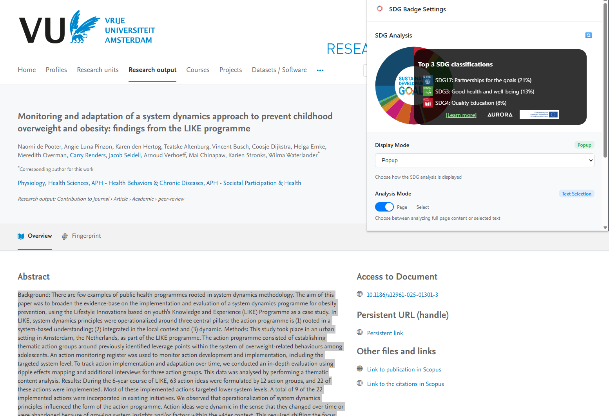

# SDG Badge Browser Extension

A cross-browser extension that displays SDG (Sustainable Development Goals) classification badges as floating widgets on webpages using the Aurora SDG API.

## Features

- **Dual Analysis Modes**: 
  - Page Mode: Analyzes full webpage content
  - Select Mode: Analyzes user-selected text with real-time updates
- **Floating Widget**: Customizable wheel-style badge with draggable positioning
- **Cross-Browser Support**: Compatible with Chrome, Firefox, Edge, and Safari
- **Responsive Design**: Adapts to different screen sizes and webpage layouts
- **Rate Limiting**: Complies with Aurora SDG API rate limits (5 requests/second)
- **Visual Feedback**: Loading states, error handling, and confidence scores



## Installation

### Chrome/Edge (Manifest V3)
1. Download the extension files
2. Rename `manifest-v3.json` to `manifest.json`
3. Open Chrome/Edge and navigate to `chrome://extensions/` or `edge://extensions/`
4. Enable "Developer mode"
5. Click "Load unpacked" and select the extension directory

### Firefox (Manifest V2)
1. Download the extension files
2. Rename `manifest-v2.json` to `manifest.json`
3. Open Firefox and navigate to `about:debugging`
4. Click "This Firefox" → "Load Temporary Add-on"
5. Select the `manifest.json` file

### Safari
1. Download the extension files
2. Use Safari's Extension Builder or convert using Safari Extension Converter
3. Follow Safari's extension installation process

## Usage

1. **Installation**: Install the extension in your browser
2. **Activation**: The extension automatically activates on all webpages
3. **Settings**: Click the extension icon to open the settings popup
4. **Mode Selection**: 
   - **Page Mode**: Automatically analyzes the full webpage content
   - **Select Mode**: Select any text on the page to get instant SDG classification
5. **Customization**: Adjust badge size (150px - 400px) using the slider
6. **Positioning**: Drag the floating widget to your preferred location

## API Integration

The extension integrates with the Aurora SDG API:
- **Endpoint**: `https://aurora-sdg.labs.vu.nl/classifier/classify/aurora-sdg-multi`
- **Method**: POST with JSON payload
- **Rate Limit**: 5 requests per second
- **Response**: SDG predictions with confidence scores and icon URLs

## File Structure

```
sdg-badge-extension/
├── manifest-v3.json          # Chrome/Edge manifest
├── manifest-v2.json          # Firefox manifest
├── icons/                    # Extension icons
│   ├── icon16.png
│   ├── icon48.png
│   └── icon128.png
├── popup/                    # Settings popup
│   ├── popup.html
│   ├── popup.css
│   └── popup.js
├── scripts/                  # Extension scripts
│   ├── background.js         # Background service worker
│   └── content.js            # Content script for webpage interaction
└── README.md                 # This file
```

## Development

### Prerequisites
- Basic knowledge of browser extension development
- Understanding of Chrome Extension APIs
- Familiarity with JavaScript, HTML, and CSS

### Local Development
1. Clone or download the extension files
2. Make modifications as needed
3. Load the extension in developer mode
4. Test functionality across different websites
5. Debug using browser developer tools

### Testing
- Test on various websites with different content structures
- Verify text selection works correctly
- Ensure API rate limiting is respected
- Test widget positioning and responsiveness
- Validate cross-browser compatibility

## Browser Compatibility

| Browser | Manifest Version | Status |
|---------|------------------|---------|
| Chrome  | V3              | ✅ Supported |
| Edge    | V3              | ✅ Supported |
| Firefox | V2              | ✅ Supported |
| Safari  | V2              | ⚠️ Manual conversion required |

## Privacy & Permissions

The extension requires the following permissions:
- `activeTab`: Access to the current webpage for content analysis
- `storage`: Save user preferences and settings
- `scripting`: Inject content scripts for widget functionality
- `host_permissions`: Access to Aurora SDG API endpoints

## Contributing

1. Fork the repository
2. Create a feature branch
3. Make your changes
4. Test across browsers
5. Submit a pull request

## License

This extension is provided as-is for educational and research purposes. The Aurora SDG API is provided by VU Amsterdam.

## Support

For issues or questions:
1. Check the browser console for error messages
2. Verify internet connectivity for API access
3. Ensure the extension has proper permissions
4. Test on different websites to isolate issues

## Credits

- **Aurora SDG API**: Provided by VU Amsterdam
- **SDG Classification**: Based on the United Nations Sustainable Development Goals
- **Widget Design**: Inspired by accessibility and user experience best practices
